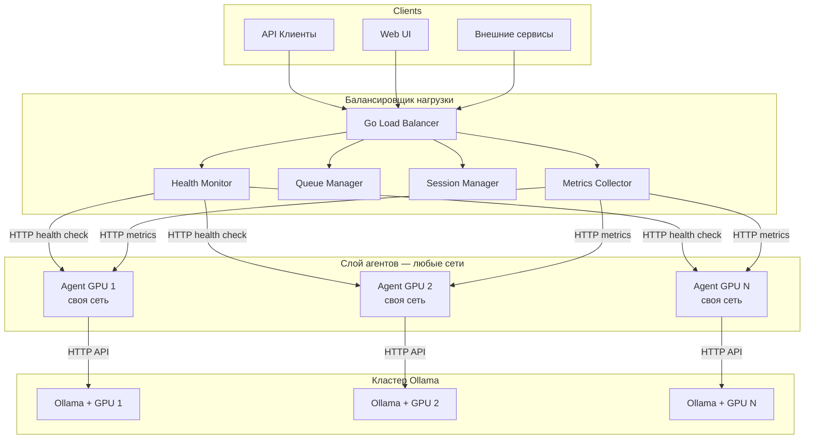
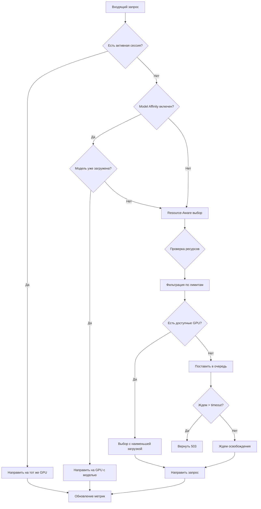

# Ollama Load Balancer — Полная документация

Интеллектуальный балансировщик нагрузки для кластера Ollama с мониторингом ресурсов GPU/CPU/RAM/Disk и умным распределением запросов.

> 🌐 **Языки документации:** [English](en/README.md) | **Русский** (текущий)

## 📚 Содержание документации

| Раздел | Описание |
|--------|----------|
| [Введение](#введение) | Общая информация о проекте |
| [Архитектура](#архитектура) | Архитектура системы и компоненты |
| [Установка](installation.md) | Требования и инструкции по установке |
| [Конфигурация](configuration.md) | Настройка всех компонентов системы |
| [Развертывание](deployment.md) | Docker Compose и production развертывание |
| [Развертывание агента](agent-deployment.md) | Развертывание агента в режимах CPU/GPU |
| [API](api.md) | REST API и WebSocket документация |
| [Метрики](ollamalegion-metrics.md) | Полный справочник всех метрик и алгоритмов |
| [Troubleshooting](troubleshooting.md) | Решение проблем и отладка |

---

## Введение

Ollama Load Balancer — это распределенная система балансировки нагрузки, предназначенная для кластеров Ollama с несколькими GPU-серверами.

### Ключевые возможности

- 🚀 **Умная балансировка** — распределение на основе доступных ресурсов GPU, CPU, RAM
- 🎯 **Model Affinity** — направление запросов к серверам с уже загруженной моделью
- 📊 **Real-time мониторинг** — метрики в реальном времени через WebSocket и Web UI
- 🔍 **Health Check** — автоматическое обнаружение нерабочих бэкендов
- 💾 **Session Stickiness** — сохранение сессии на одном сервере
- 🔄 **Queue Manager** — обработка перегрузок с очередью запросов
- 🐳 **Docker Ready** — готовые Dockerfile и docker-compose конфигурации
- 📈 **Ollama API Integration** — активные запросы, RPS, запущенные модели
- 🎮 **NVML Support** — точные метрики GPU через NVIDIA Management Library

### Компоненты системы

| Компонент | Описание | Порт(ы) |
|-----------|----------|---------|
| **Load Balancer** | Reverse proxy с балансировкой нагрузки | 18080, 18081 |
|   **Queue Manager** | Обработка перегрузок с очередью запросов | - |
|   **WebSocket Server** | Real-time трансляция метрик | 18081/ws |
|   **Predictor** | Прогнозирование критических состояний | - |
|   **Metrics Broker** | Pub/sub система для распределения метрик | - |
| **Agent (Linux/Windows)** | Сбор метрик GPU/CPU/RAM/Disk | 18032 |
| **NVML Integration** | NVIDIA Management Library для GPU метрик | - |
| **Ollama API** | Интеграция с Ollama API для статистики | 11434 |
| **Health Checker** | Автоматическая проверка здоровья бэкендов | - |
| **Session Manager** | Управление сессиями клиентов | - |
| **Web UI** | Dashboard для мониторинга | 18030 |
| **Monitor** | Real-time Canvas-визуализация кластера | 18030/monitor.html |

---

## Архитектура

### Общая схема

```
┌─────────────┐     ┌──────────────────────────────────────┐     ┌─────────────┐
│   Clients   │────▶│         Load Balancer                │────▶│   Agent 1   │───▶ Ollama + GPU 1
│  (API/Web)  │     │  ┌────────────────────────────────┐  │     │             │
└─────────────┘     │  │  Reverse Proxy + Queue Manager │  │     └──────┬──────┘
                    │  └────────────────────────────────┘  │            │
                    │  ┌────────────────────────────────┐  │            │
                    │  │  WebSocket Server (Metrics)    │◀─┼────────────┘
                    │  └────────────────────────────────┘  │
                    │  ┌────────────────────────────────┐  │
                    │  │  Ollama API Integration        │  │
                    └──────────────────────────────────────┘
                               │
                               ▼
                    ┌──────────────────┐
                    │     Web UI       │
                    │   (Dashboard)    │
                    └──────────────────┘
```

### Диаграмма потоков данных



> **Примечание:** Агенты и балансер **НЕ обязаны** находиться в одной сети. 
> Единственное требование — взаимная IP-доступность по HTTP между компонентами.

### Алгоритм принятия решений



---

## Алгоритмы балансировки

### Resource-Aware (по умолчанию)

Распределение на основе доступных ресурсов:
- GPU загрузка < 90%
- VRAM использование < 85%
- CPU загрузка < 80%
- RAM использование < 85%
- Свободно на диске > 10GB

### Model Affinity

Если модель уже загружена на каком-то сервере, запрос направляется туда.

### Session Stickiness

Клиент с той же сессией (IP или X-Session-ID header) попадает на тот же сервер.

### Queue Manager

При отсутствии доступных бэкендов запросы ставятся в очередь:
- Максимальный размер очереди: 100 запросов
- Таймаут ожидания: 300 секунд
- Обработка в порядке поступления (FIFO)

---

## Таблица портов

| Порт | Компонент | Описание |
|------|-----------|----------|
| **18080** | Load Balancer | Ollama API Proxy (внешний) |
| **18081** | Load Balancer | Management API + WebSocket |
| **18030** | Web UI | Dashboard (nginx) |
| **18032** | Agent | Локальные метрики агента |
| **11434** | Ollama | Ollama API (на бэкендах) |
| **8443** | Load Balancer | HTTPS Proxy (TLS) |
| **8444** | Load Balancer | HTTPS Management API (TLSPort+1) |

---

## Структура проекта

```
ollama-loadbalancer/
├── cmd/
│   ├── balancer/          # Бинарник балансировщика
│   ├── agent/             # Бинарник агента
│   └── monitor/           # Монитор (отдельный бинарник)
├── internal/
│   ├── balancer/          # Логика балансировки
│   │   ├── proxy.go       # Reverse proxy + selectBackend
│   │   ├── health.go      # Health check
│   │   ├── predictor.go   # Прогнозирование загрузки
│   │   ├── session_manager.go   # Управление сессиями (TTL + cleanup)
│   │   ├── metrics_manager.go   # Хранение метрик бэкендов
│   │   ├── queue_manager.go     # Очередь запросов + workers
│   │   ├── candidate.go         # Candidate groups (P1-P4) для выбора бэкенда
│   │   ├── scoring.go           # Мультифакторный scoring (simple + enhanced)
│   │   ├── streaming.go         # SSE streaming с heartbeat
│   │   ├── eventbus.go          # Pub/sub событий кластера
│   │   ├── client.go            # Client fingerprint, session ID, real IP
│   │   └── state.go             # Сохранение/загрузка state.json
│   ├── api/               # REST API handlers
│   │   ├── handlers.go           # Server struct, NewServer, WebSocket, CORS
│   │   ├── handlers_backends.go  # Backends CRUD, limits, capacity
│   │   ├── handlers_agents.go    # Agent register, metrics, heartbeat
│   │   ├── handlers_cluster.go   # Cluster state, runtime config switching
│   │   ├── handlers_queue.go     # Queue stats, details, history
│   │   ├── handlers_sessions.go  # Sessions CRUD, models list
│   │   ├── handlers_metrics.go   # Cluster/backend metrics, predictions
│   │   ├── handlers_replication.go # Model replication groups
│   │   ├── handlers_virtual.go   # Virtual models, candidates
│   │   ├── handlers_core.go      # Health, restart, static files, autoPull
│   │   ├── routes.go             # Регистрация HTTP маршрутов
│   │   ├── auth.go               # Аутентификация
│   │   └── metrics_broker.go    # WebSocket pub/sub
│   ├── agent/             # Логика агента
│   │   ├── collector.go   # Сбор метрик
│   │   ├── nvml_unix.go   # NVML integration (Linux)
│   │   ├── nvml_windows.go# NVML integration (Windows)
│   │   └── system.go      # Системные метрики
│   ├── config/            # Конфигурация
│   ├── modelreplication/  # Репликация моделей (Variant A)
│   ├── rpccoordinator/    # RPC координатор (Variant B)
│   ├── virtualmodel/      # Виртуальные модели (Variant C)
│   └── distinference/     # Распределённый инференс (Variant D)
├── pkg/
│   ├── logger/            # Библиотека логирования
│   ├── protocol/          # Протокол агент↔балансер
│   └── types/             # Типы данных
├── webui/
│   ├── js/                # JavaScript модули (app, i18n)
│   ├── css/               # Стили (style, themes)
│   └── monitor.html       # Монитор real-time
├── docker/
│   ├── balancer/          # Dockerfile балансировщика
│   ├── agent/             # Dockerfile агента
│   ├── webui/             # Dockerfile UI
│   └── cocoindex/         # CocoIndex embeddings
├── deployments/
│   ├── docker-compose.yml # Docker Compose (ядро)
│   └── docker-compose.agent.yml # Docker Compose (агент)
├── tests/                 # Интеграционные и сценарные тесты
├── scripts/               # Скрипты сборки и деплоя
├── logo/                  # Логотип (png, svg)
├── config/
│   └── config.example.json # Пример конфигурации
└── docs/
    ├── README.md          # Эта документация
    ├── ru/                # Русская версия документации
    ├── en/                # English documentation
    ├── plans/             # Планы развития
    ├── ollamalegion-metrics.md # Справочник метрик
    ├── balancing-guide.md  # Руководство по балансировке
    ├── installation.md    # Установка
    ├── configuration.md   # Конфигурация
    ├── deployment.md      # Развертывание
    ├── api.md             # API документация
    └── troubleshooting.md # Решение проблем
```

---

## Быстрые ссылки

- 📖 [Установка и сборка](installation.md) — Требования, Docker установка, сборка из исходников
- ⚙️ [Конфигурация](configuration.md) — Настройка балансировщика, агента, TLS, аутентификация
- 🚀 [Развертывание](deployment.md) — Docker Compose, production deployment, масштабирование
- 🤖 [Развертывание агента](agent-deployment.md) — Развертывание агента в режимах CPU/GPU
- 📡 [API документация](api.md) — REST API endpoints, WebSocket, примеры запросов
- 🔧 [Troubleshooting](troubleshooting.md) — Частые ошибки, логирование, отладка NVML
- 📋 [OpenAPI спецификация](openapi.yaml) — Полная API спецификация в формате OpenAPI 3.0.3

---

## Лицензия

MIT License