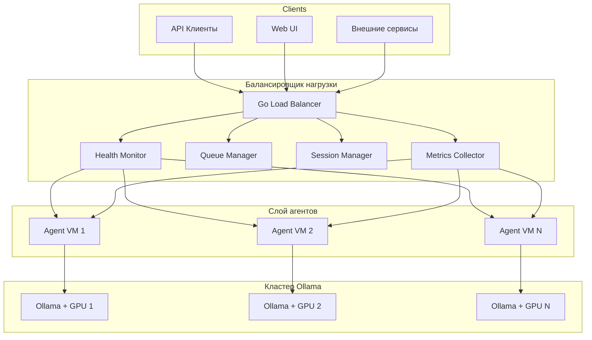
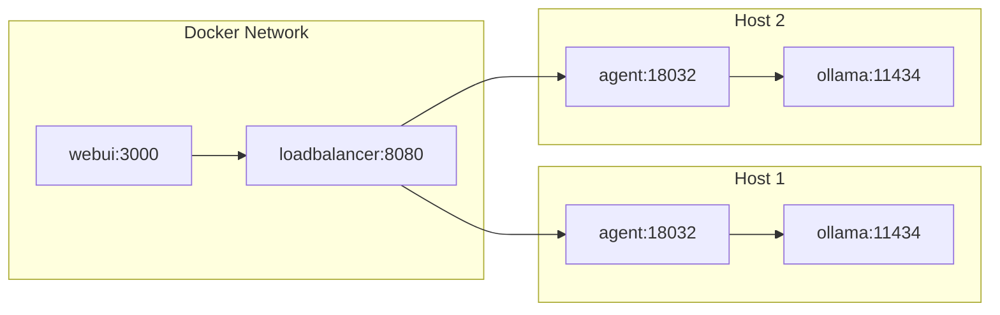
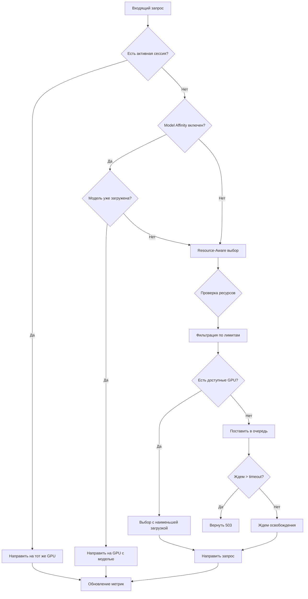

# Архитектура системы балансировки запросов к Ollama

## Обзор системы

Система представляет собой распределенный балансировщик нагрузки для кластера Ollama с интеллектуальным распределением запросов на основе метрик ресурсов GPU/CPU/RAM/Disk и состояния запущенных моделей.

## Компоненты системы



## 1. Балансировщик нагрузки (Go Load Balancer)

### Основные компоненты:

| Компонент | Описание |
|-----------|----------|
| **HTTP Proxy** | Проксирование запросов к API Ollama с поддержкой streaming |
| **Load Balancer Core** | Ядро балансировки с алгоритмами распределения |
| **Health Monitor** | Мониторинг доступности бэкендов |
| **Queue Manager** | Управление очередью запросов при перегрузке |
| **Session Manager** | Отслеживание активных сессий и моделей |
| **Metrics Collector** | Сбор и агрегация метрик от агентов |
| **REST API** | API для управления и получения метрик |
| **WebSocket Server** | Real-time обновления для UI |

### Алгоритмы балансировки:

1. **Resource-Aware Balancing** - распределение на основе доступных ресурсов
2. **Model Affinity** - направление запросов к серверам с уже загруженной моделью
3. **Least Connections** - направление к серверу с наименьшим количеством активных запросов
4. **Weighted Round Robin** - циклическое распределение с весами
5. **Fallback** - автоматическое переключение при ошибке

## 2. Агент сбора метрик (Node Agent)

### Собираемые метрики:

#### GPU Метрики (через nvidia-smi / NVML):
- Загрузка GPU (%)
- Использование VRAM (MB/GB)
- Температура GPU (°C)
- Мощность (W)
- Clock frequencies

#### Системные метрики:
- Использование CPU (%)
- Использование RAM (MB/GB)
- Свободное место на диске (GB)
- Network I/O

#### Ollama API метрики:
- Запущенные модели (через `/api/tags`)
- Статус моделей (через `/api/ps`)
- Активные запросы
- Время ответа API

### Протокол передачи:
- **Push-модель**: Агент отправляет метрики каждые 5 секунд
- **Pull-модель**: Балансировщик может запросить актуальные метрики
- **Heartbeat**: Сигнал доступности каждые 3 секунды
- **Event-driven**: Мгновенное уведомление о критических изменениях

## 3. Web UI

### Функционал:
- Dashboard с общей картиной кластера
- Детальная информация по каждому узлу
- Графики нагрузки в реальном времени
- Управление бэкендами (добавление/удаление)
- Просмотр активных сессий и моделей
- Логи и события
- Настройка правил балансировки

## API Структура

### Балансировщик API:

```
GET  /api/v1/health          - Статус балансировщика
GET  /api/v1/backends        - Список бэкендов
GET  /api/v1/backends/:id    - Детали бэкенда
POST /api/v1/backends        - Добавить бэкенд
PUT  /api/v1/backends/:id    - Обновить бэкенд
DELETE /api/v1/backends/:id  - Удалить бэкенд
GET  /api/v1/metrics         - Текущие метрики кластера
GET  /api/v1/metrics/:id     - Метрики конкретного бэкенда
GET  /api/v1/sessions        - Активные сессии
GET  /api/v1/models          - Запущенные модели
WS   /ws/metrics             - WebSocket для real-time метрик
```

### Агент API (внутренний):

```
POST /agent/register         - Регистрация агента
POST /agent/metrics          - Отправка метрик
POST /agent/heartbeat        - Heartbeat сигнал
GET  /agent/config           - Получение конфигурации
```

### Ollama API Endpoints (проксируемые):

```
POST /api/generate           - Генерация текста
POST /api/chat               - Chat completion
POST /api/embeddings         - Embeddings
GET  /api/tags               - Список моделей
GET  /api/ps                 - Запущенные модели
POST /api/pull               - Pull модели
POST /api/delete             - Delete модели
```

## Формат конфигурации

```json
{
  "loadBalancer": {
    "host": "0.0.0.0",
    "port": 8080,
    "apiPort": 8081
  },
  "backends": [
    {
      "id": "gpu-1",
      "name": "GPU Server 1",
      "host": "192.168.13.66",
      "ollamaPort": 11434,
      "agentPort": 18032,
      "weight": 1,
      "maxConcurrentRequests": 10,
      "labels": ["nvidia", "rtx4090"]
    }
  ],
  "balancing": {
    "algorithm": "resource-aware",
    "modelAffinity": true,
    "sessionStickiness": true,
    "healthCheckInterval": 10,
    "metricsInterval": 5
  },
  "resources": {
    "gpu": {
      "maxUsagePercent": 90,
      "maxVramUsagePercent": 85
    },
    "cpu": {
      "maxUsagePercent": 80
    },
    "memory": {
      "maxUsagePercent": 85
    },
    "disk": {
      "minFreeGB": 10
    }
  },
  "logging": {
    "level": "info",
    "format": "json"
  }
}
```

## Протокол обмена метриками

```json
{
  "agentId": "gpu-1",
  "timestamp": "2024-01-15T10:30:00Z",
  "gpu": {
    "usage": 75.5,
    "memoryTotal": 24576,
    "memoryUsed": 18432,
    "memoryFree": 6144,
    "temperature": 68,
    "powerUsage": 280
  },
  "system": {
    "cpuUsage": 45.2,
    "memoryTotal": 65536,
    "memoryUsed": 32768,
    "memoryFree": 32768,
    "diskTotal": 1000000,
    "diskUsed": 450000,
    "diskFree": 550000
  },
  "ollama": {
    "runningModels": [
      {
        "name": "llama3.1:70b",
        "size": 42000000000,
        "vram": 18000,
        "expiresAt": "2024-01-15T11:00:00Z"
      }
    ],
    "activeRequests": 3,
    "totalRequests": 1250,
    "avgResponseTime": 1250
  }
}
```

## Docker Архитектура



### Docker Compose структура:

```yaml
version: '3.8'

services:
  loadbalancer:
    image: ollama-legion/balancer:latest
    ports:
      - "8080:8080"  # Ollama API proxy
      - "8081:8081"  # Management API
    volumes:
      - ./config:/app/config
    networks:
      - ollama-legion-net
    restart: unless-stopped

  webui:
    image: ollama-legion/webui:latest
    ports:
      - "3000:3000"
    environment:
      - BALANCER_API_URL=http://loadbalancer:8081
    depends_on:
      - loadbalancer
    networks:
      - ollama-legion-net
    restart: unless-stopped
```

### Агент (отдельный контейнер на каждом GPU сервере):

```yaml
version: '3.8'

services:
  ollama-agent:
    image: ollama-legion/agent:latest
    ports:
      - "18032:18032"
    volumes:
      - /var/run/nvidia-smi:/var/run/nvidia-smi
      - /proc:/host/proc:ro
      - /sys:/host/sys:ro
    environment:
      - BALANCER_URL=http://balancer-host:8081
      - AGENT_ID=gpu-1
      - NVIDIA_VISIBLE_DEVICES=all
    devices:
      - /dev/nvidia0:/dev/nvidia0
    networks:
      - host
    restart: unless-stopped
```

## Алгоритм принятия решений



## План реализации

### Фаза 1: Базовая инфраструктура
1. Создание структуры проекта Go
2. Реализация HTTP прокси для Ollama API
3. Базовая конфигурация и загрузка бэкендов
4. Простой Round Robin балансировщик

### Фаза 2: Агенты и метрики
5. Разработка агента для сбора метрик
6. Протокол передачи метрик
7. Metrics Collector в балансировщике
8. Health Check система

### Фаза 3: Умная балансировка
9. Resource-Aware алгоритм
10. Model Affinity логика
11. Session Manager
12. Queue Manager

### Фаза 4: UI и мониторинг
13. REST API для управления
14. WebSocket для real-time данных
15. Web UI Dashboard
16. Графики и визуализация

### Фаза 5: Docker и деплой
17. Dockerfile для балансировщика
18. Dockerfile для агента
19. Dockerfile для UI
20. Docker Compose конфигурация
21. Документация по деплою

## Структура проекта

```
ollama-loadbalancer/
├── cmd/
│   ├── balancer/          # Основной бинарник балансировщика
│   ├── agent/             # Бинарник агента
│   └── webui/             # Бинарник UI (опционально)
├── internal/
│   ├── balancer/
│   │   ├── proxy.go       # HTTP прокси
│   │   ├── scheduler.go   # Планировщик запросов
│   │   ├── health.go      # Health checks
│   │   └── metrics.go     # Сбор метрик
│   ├── agent/
│   │   ├── collector.go   # Сборщик метрик
│   │   ├── gpu.go         # GPU метрики (NVML)
│   │   ├── system.go      # Системные метрики
│   │   └── ollama.go      # Ollama API клиент
│   ├── api/
│   │   ├── handlers.go    # REST API handlers
│   │   └── websocket.go   # WebSocket server
│   └── config/
│       └── config.go      # Конфигурация
├── pkg/
│   ├── types/             # Общие типы данных
│   └── protocol/          # Протокол обмена
├── webui/
│   ├── src/               # React/Vue исходники
│   └── dist/              # Собранный UI
├── docker/
│   ├── balancer/
│   │   └── Dockerfile
│   ├── agent/
│   │   └── Dockerfile
│   └── webui/
│       └── Dockerfile
├── deployments/
│   └── docker-compose.yml
├── config/
│   └── config.example.json
├── go.mod
├── go.sum
└── README.md
```

## Требования к ресурсам

### Балансировщик:
- CPU: 2 cores
- RAM: 512 MB - 1 GB
- Disk: 100 MB
- Network: 1 Gbps

### Агент (на каждом узле):
- CPU: 0.5 cores
- RAM: 128 MB
- Disk: 50 MB

### Web UI:
- CPU: 1 core
- RAM: 256 MB
- Disk: 100 MB

## Безопасность

- API Token аутентификация
- TLS/SSL поддержка
- Rate limiting
- CORS настройка
- Изоляция сетей Docker
